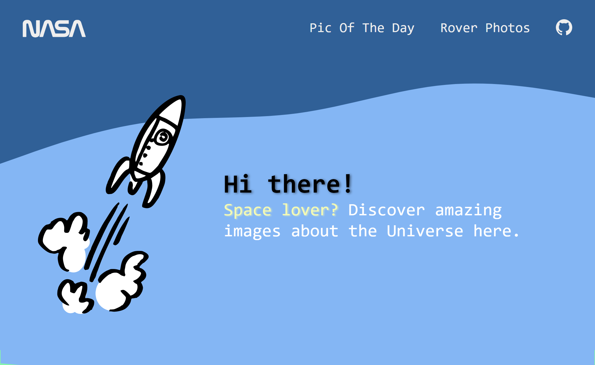

# NASA APP 

This is an app based in [NASA API](https://api.nasa.gov/). The objective of this API is to make NASA data, including imagery, eminently accessible to application developers. 
## Table of contents

- [Overview](#overview)
  - [Screenshot](#screenshot)
  - [Links](#links)
- [My process](#my-process)
  - [Built with](#built-with)
  - [What I learned](#what-i-learned)
- [Author](#author)
- [Acknowledgments](#acknowledgments)


## Overview

This is a Nasa APP built with ReactJS, Styled Components, JavaScrip, JSX, CSS and HTML. In this webpage you can see the pic of the day, and a gallery of photos by two Rover's. 

### Screenshot




### Links

- Proyect URL: [Git Proyect](https://github.com/Kevin-Cay/nasa-app-react.git)
- Live Site URL: [Live Site](https://mystifying-wescoff-d706ea.netlify.app/)

## My process
First I created the entire structure with HTML then i add styled components. Also, I created all the parts. Finally, I connected all in the App Component with the Nasa API.

### Built with

- ReactJS
- Flexbox
- CSS Grid
### What I learned

This is some of the code that I learned about API fetch, and some configurations in the components. 


```js
export async function getData(){
  try{
    const apiKey = process.env.REACT_APP_NASA_APIKEY    
    const resCuriosity = await fetch(`https://api.nasa.gov/mars-photos/api/v1/rovers/curiosity/latest_photos?&page=1&api_key=${apiKey}`)
    const dataCuriosity = await resCuriosity.json() 
    const resPerseverance = await fetch(`https://api.nasa.gov/mars-photos/api/v1/rovers/perseverance/latest_photos?&page=1&api_key=${apiKey}`)
    const dataPerseverance = await resPerseverance.json()
    return{
      props: {
        dataCuriosity : dataCuriosity,
        dataPerseverance: dataPerseverance,
      },
      revalidate: 10,
    }
  } catch (error) {
    console.log(error)
  }
}
```


## Author

- Website - [Kevin Cay](https://portfolio-kevin-cay.vercel.app/)
- Frontend Mentor - [@kevincay](https://www.frontendmentor.io/profile/Kevin-Cay)
- Github - [@Kevin-Cay](https://github.com/Kevin-Cay/)


## Acknowledgments

A tip that i can give you is lear about API fetch and async/await functions.